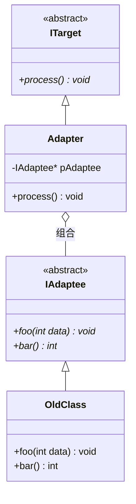
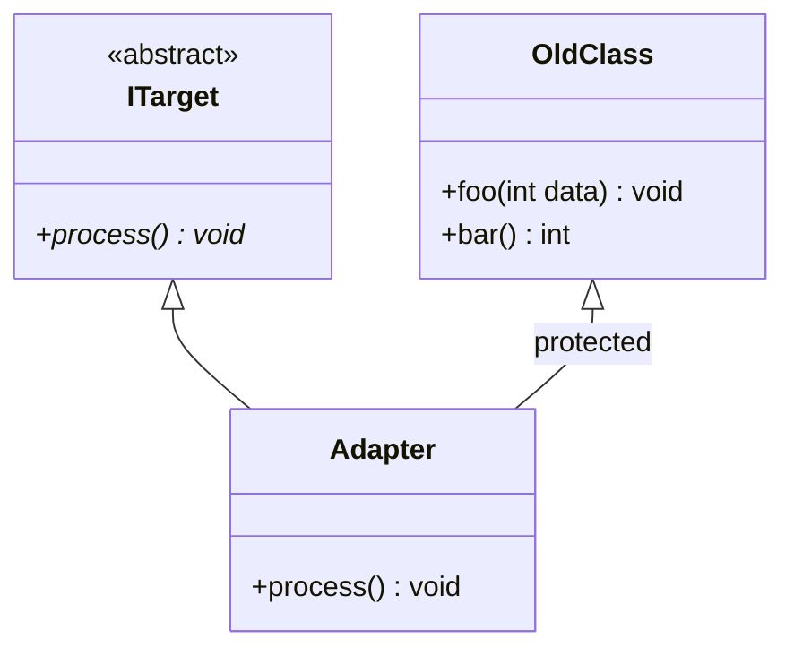
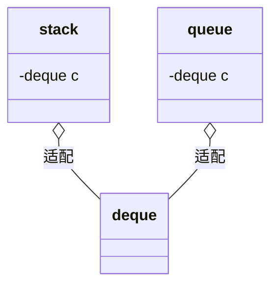

# Adapter

## 动机(Motivation)
+ 由于应用环境的变化，常常需要将”一些现存的对象“放在新的环境中应用，但是新环境要求的接口是这些现存对象所不满足。
+ 如何应对这些”迁移的变化“？

## 模式定义
将一个类的接口转换成客户希望的另一个接口。Adapter模式使得原本由于接口不兼容而不能一起工作的那些类可以一起工作。
——《设计模式》GoF

## 结构

### 对象适配器（Object Adapter）—— 推荐方式

> Adapter 继承 `ITarget`（is-a），同时持有 `IAdaptee*`（has-a），`process()` 内部委托给 `pAdaptee->bar()` + `pAdaptee->foo()`。

### 类适配器（Class Adapter）—— 多重继承方式

> Adapter 同时继承 `ITarget`（public）和 `OldClass`（protected），直接复用 `OldClass` 的方法。

### STL 中的适配器示例

> `stack` 和 `queue` 都是容器适配器，底层默认使用 `deque`，但只暴露受限接口。

## 要点总结
+ 在遗留代码复用、类库迁移等方面有用
