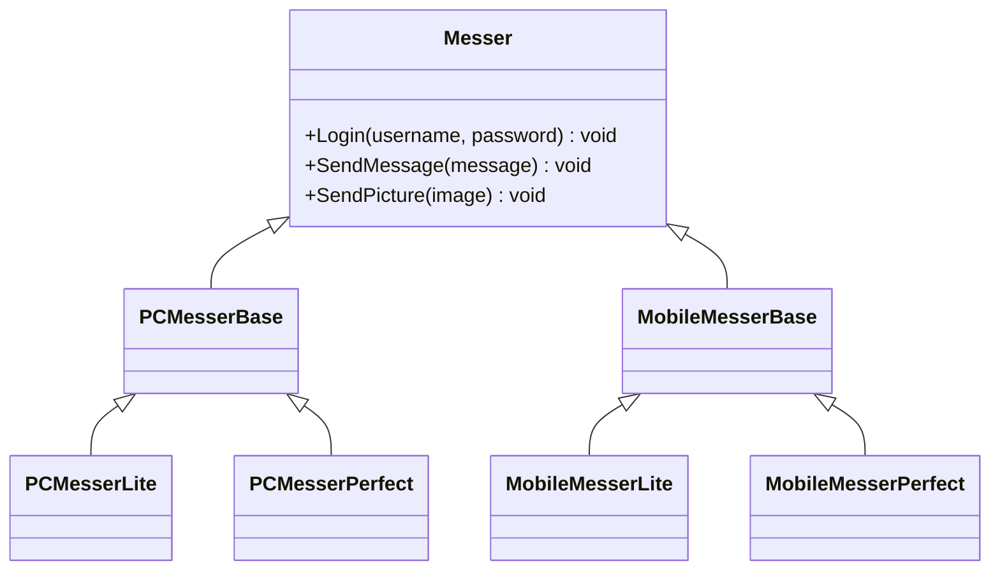
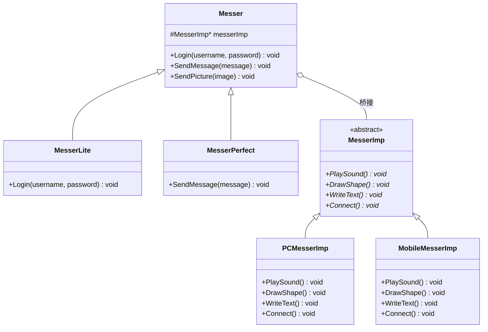

# Bridge

## 动机（Motivation）
+ 由于某些类型的固有的实现逻辑，使得它们具有两个变化的维度，乃至多个纬度的变化。
+ 如何应对这种“多维度的变化”？如何利用面向对象技术来使得类型可以轻松地沿着两个乃至多个方向变化，而不引入额外的复杂度？

## 模式定义
将抽象部分(业务功能)与实现部分(平台实现)分离，使它们都可以独立地变化。
——《设计模式》GoF
## 结构演化

### 阶段一：无 Bridge（bridge1.cpp）—— 两个维度耦合

> 问题：业务类型（Lite/Perfect）与平台（PC/Mobile）两个维度耦合在一起，组合爆炸。

### 阶段二：Bridge 模式（bridge2.cpp）—— 维度分离

> 完美：抽象部分（Messer 系列）与实现部分（MesserImp 系列）各自独立变化。业务类型和平台解耦。
## 要点总结
+ Bridge模式使用“对象间的组合关系”解耦了抽象和实现之间固有的绑定关系，使得抽象和实现可以沿着各自的维度来变化。所谓抽象和实现沿着各自纬度的变化，即“子类化”它们。
+ Bridge模式有时候类似于多继承方案，但是多继承方案往往违背单一职责原则（即一个类只有一个变化的原因），复用性比较差。Bridge模式是比多继承方案更好的解决方法。
+ Bridge模式的应用一般在“两个非常强的变化维度”，有时一个类也有多于两个的变化维度，这时可以使用Bridge的扩展模式。
