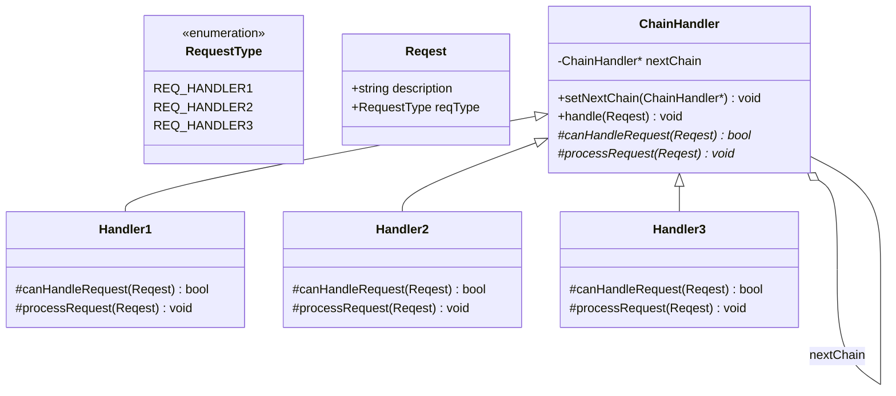

# Chain of Resposibility(职责链)

## 动机(Motivation)
+ 一个请求可能被多个对象处理，但是每个请求在运行时只能有一个接收者，如果显式指定，将必不可少地带来请求发送者与接收者的紧耦合。
+ 如何使请求的发送者不需要指定具体的接收者？让请求的接收者自己在运行时决定来处理请求，从而使两者解耦。

## 模式定义
使多个对象都有机会处理请求，从而避免请求的发送者和接收者之间的耦合关系。将这些对象连成一条链，并沿着这条链传递请求，直到有一个对象处理它为止。
——《设计模式》GoF
## 结构

> `ChainHandler::handle()` 是模板方法：先调用 `canHandleRequest()` 判断是否处理，若不能处理则通过 `nextChain` 传递给下一个节点。
## 要点总结
+ 应用于”一个请求可能有多个接受者，但是最后真正的接受者只有一个“，这时候请求发送者与接受者有可能出现”变化脆弱“的症状，职责链解耦。
+ 有些过时。
