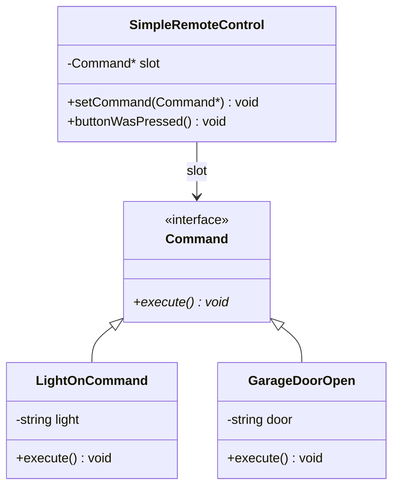

## 命令模式

```mermaid
classDiagram
    direction TB

    class Command {
        <<interface>>
        +execute() void*
    }

    class LightOnCommand {
        -string light
        +execute() void
    }

    class GarageDoorOpen {
        -string door
        +execute() void
    }

    class SimpleRemoteControl {
        -Command* slot
        +setCommand(Command*) void
        +buttonWasPressed() void
    }

    Command <|-- LightOnCommand
    Command <|-- GarageDoorOpen
    SimpleRemoteControl --> Command : slot
```

> `SimpleRemoteControl` 是 Invoker（调用者），`LightOnCommand` / `GarageDoorOpen` 是 ConcreteCommand（具体命令）。Invoker 只依赖 `Command` 接口，与具体命令解耦。

