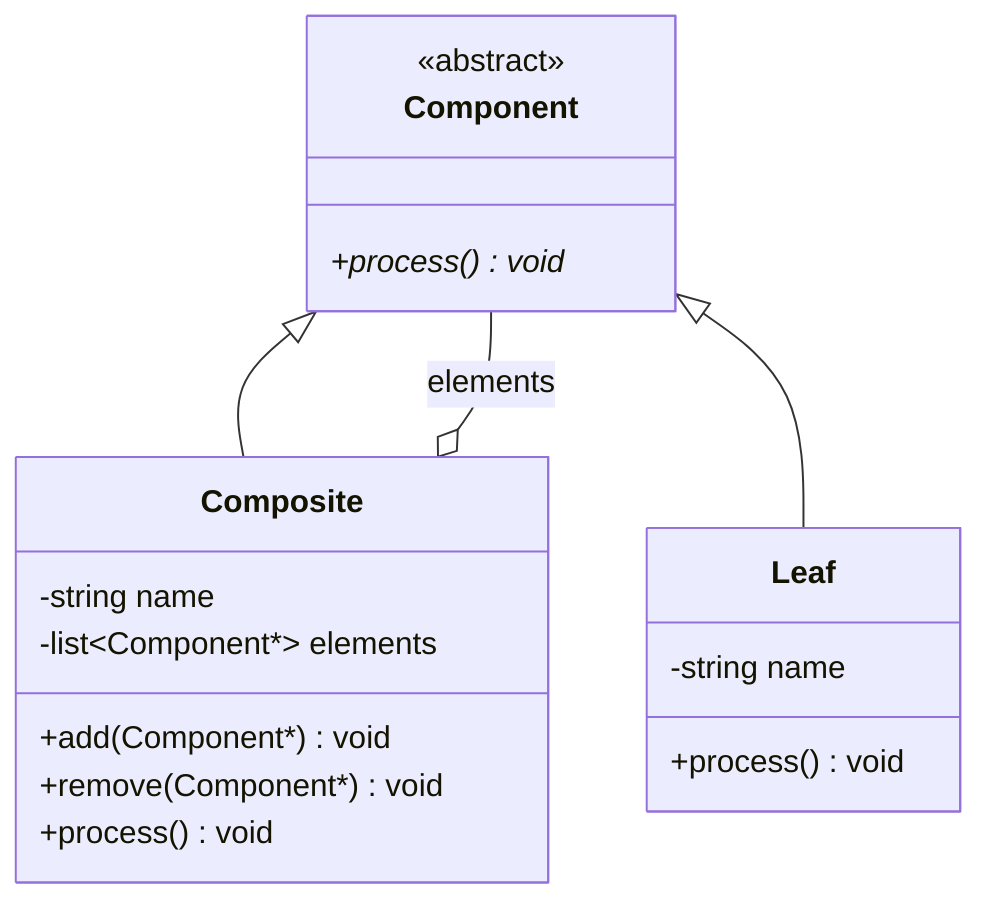
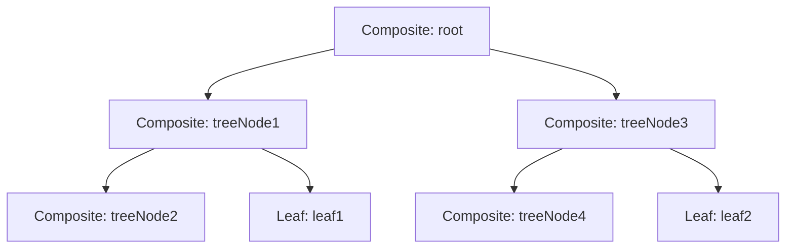

# Composite

## 动机(Motivation)
+ 客户代码过多地依赖于对象容器复杂的内部实现结构，对象容器内部实现结构(而非抽象结构)的变化
引起客户代码的频繁变化，带来了代码的维护性、扩展性等弊端。
+ 如何将”客户代码与复杂的对象容器结构“解耦？让对象容器自己来实现自身的复杂结构，从而使得客户代码就像处理简单对象一样来处理复杂的对象容器？

## 模式定义
将对象组合成树形结构以表示”部分-整体“的层次结构。Composite使得用户对单个对象和组合对象的使用具有一致性(稳定)。
——《设计模式》GoF
## 结构

> `Composite` 既继承 `Component`（is-a），又持有 `Component*` 集合（has-a），形成递归组合结构。客户端通过 `Component` 接口统一处理 `Leaf` 和 `Composite`。

### 运行时对象结构示例

## 要点总结
+ Composite模式采用树性结构来实现普遍存在的对象容器，从而将”一对多“的关系转化为”一对一“的关系，使得客户代码可以一致地(复用)处理对象和对象容器，
无需关心处理的是单个的对象，还是组合的对象容器。
+ 客户代码与纯粹的抽象接口——而非对象容器的内部实现结构——发生依赖，从而更能”应对变化“。
+ Composite模式在具体实现中，可以让父对象中的子对象反向追溯；如果父对象有频繁的遍历需求，可使用缓存技术来改善效率。
