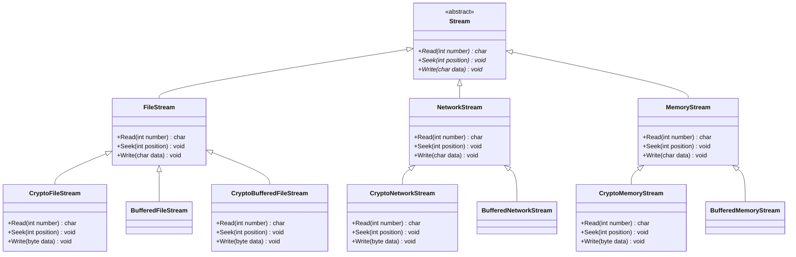
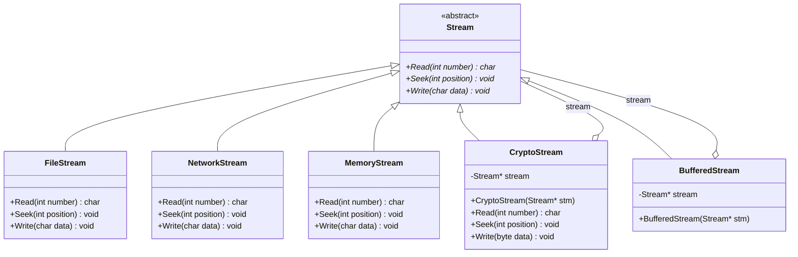
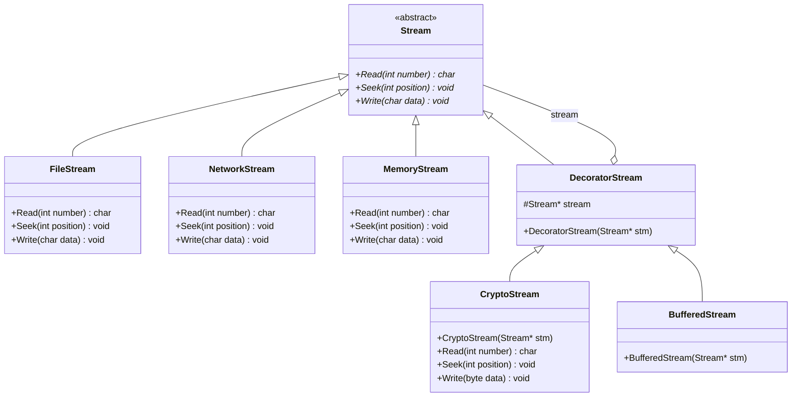

# Decorator

## 动机（Motivation）
+ 在某些情况下我们可能会“过度地使用继承来扩展对象的功能”，由于继承为类型引入的静态特质，使得这种扩展方式缺乏灵活性；
并且随着子类的增多（扩展功能的增多），各种子类的组合（扩展功能的组合）会导致更多子类的膨胀。
+ 如何使“对象功能的扩展”能够根据需要来动态地实现？同时避免“扩展功能的增多”带来的子类膨胀问题？从而使得任何“功能扩展变化”所导致的影响将为最低？

## 模式定义
动态（组合）地给一个对象增加一些额外的职责。就增加功能而言，Decorator模式比生成子类（继承）更为灵活（消除重复代码 & 减少子类个数）。
——《设计模式》GoF
## 结构演化

### 阶段一：继承方式（decorator1.cpp）—— 子类爆炸



> 问题：每增加一种扩展功能（加密/缓冲），就要为每种流类型新增子类，组合数呈 M×N 爆炸。

### 阶段二：组合方式（decorator2.cpp）—— 引入组合



> 改进：CryptoStream / BufferedStream 通过持有 `Stream*` 指针（组合），可装饰任意 Stream 子类。但两个装饰类中 `Stream* stream` 成员重复。

### 阶段三：经典 Decorator 模式（decorator3.cpp）—— 提取中间层



> 完美：提取 `DecoratorStream` 中间层，消除重复的 `Stream*` 成员。运行时可以任意嵌套装饰：
> ```cpp
> FileStream* s1 = new FileStream();
> CryptoStream* s2 = new CryptoStream(s1);          // 加密 + 文件流
> BufferedStream* s3 = new BufferedStream(s1);       // 缓冲 + 文件流
> BufferedStream* s4 = new BufferedStream(s2);       // 缓冲 + 加密 + 文件流
> ```
## 要点总结
+ 通过采用组合而非继承的手法， Decorator模式实现了在运行时动态扩展对象功能的能力，而且可以根据需要扩展多个功能。
避免了使用继承带来的“灵活性差”和“多子类衍生问题”。
+ Decorator类在接口上表现为is-a Component的继承关系，即Decorator类继承了Component类所具有的接口。
但在实现上又表现为has-a Component的组合关系，即Decorator类又使用了另外一个Component类。
+ Decorator模式的目的并非解决“多子类衍生的多继承”问题，Decorator模式应用的要点在于解决“主体类在多个方向上的扩展功能”——是为“装饰”的含义。
