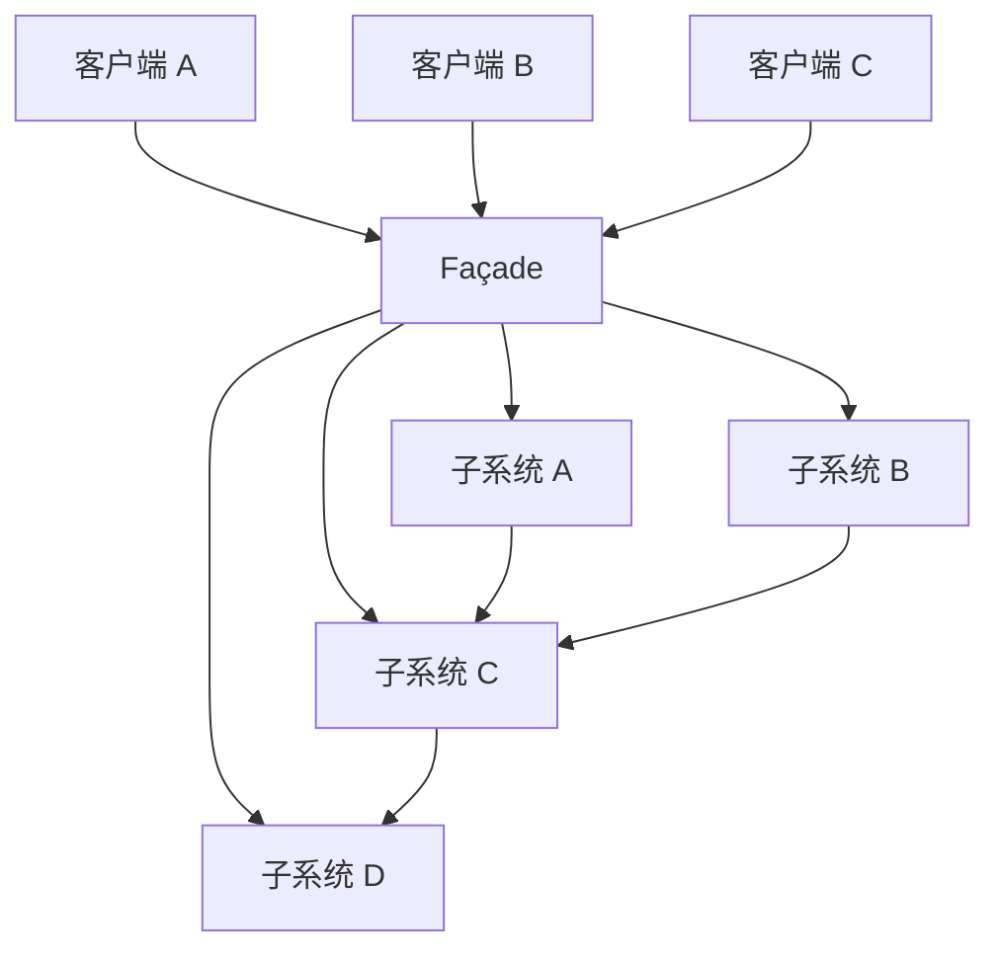

# Façade(门面模式)

## 动机(Motivation)
+ 客户和组件中各种复杂的子系统有过多的耦合
+ 如何简化外部客户程序和系统间的交互接口？如何解耦？

## 模式定义
为子系统中的一组接口提供一个一致(稳定)的界面，Façade模式定义了一个高层接口，这个接口使得这一子系统更加容易使用(复用)。
——《设计模式》GoF
## 结构

> Façade 为复杂的子系统提供一个统一的高层接口。客户端只依赖 Façade，子系统内部互相耦合但与外部解耦。
## 要点总结
+ 从客户程序角度来看，Façade模式简化了整个组件系统的接口，对于组件内部与外部的客户程序来说，
达到了一种”解耦“的效果——内部子系统的任何变化不会影响到Façade接口的变化。
+ Façade设计模式更注重架构的层次去看整个系统，而不是单个类的层次。Façade很多时候是一种架构设计模式。
+ Façade设计模式并非一个集装箱，可以任意地放进任何多个对象。Façade模式组件中的内部应该是”相互耦合关系比较大的一系列组件“，而不是一个简单的功能集合。
