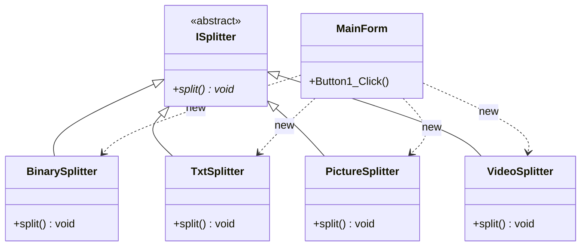
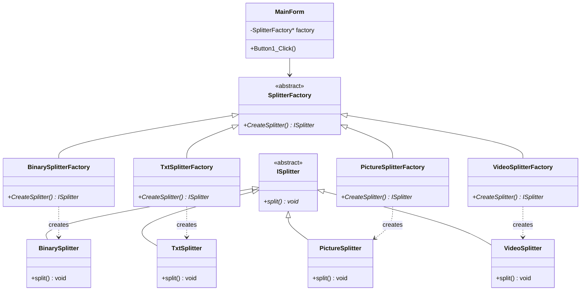

# Factory Method

## 动机（Motivation）
+ 在软件系统中，经常面临着创建对象的工作；由于需求的变化，需要创建的对象的具体类型经常变化。
+ 如何应对这种变化？如何绕过常规的对象创建方法(new)，提供一种“封装机制”来避免客户程序和这种“具体对象创建工作”的紧耦合？

## 模式定义
定义一个用于创建对象的接口，让子类决定实例化哪一个类。Factory Method使得一个类的实例化延迟（目的：解耦，手段：虚函数）到子类。
——《设计模式》GoF
## 结构演化

### 阶段一：无工厂（MainForm1.cpp）—— 紧耦合

> 问题：`MainForm` 直接 `new` 具体 Splitter 类型，与所有具体类紧耦合。

### 阶段二：Factory Method（MainForm2.cpp）—— 解耦

> 完美：`MainForm` 只依赖抽象的 `SplitterFactory` 和 `ISplitter`，具体类型通过工厂创建，新增类型只需增加工厂子类。
## 要点总结
+ Factory Method模式用于隔离类对象的使用者和具体类型之间的耦合关系。面对一个经常变化的具体类型，紧耦合关系(new)会导致软件的脆弱。
+ Factory Method模式通过面向对象的手法，将所要创建的具体对象工作延迟到子类，从而实现一种扩展（而非更改）的策略，较好地解决了这种紧耦合关系。
+ Factory Method模式解决“单个对象”的需求变化。缺点在于要求创建方法/参数相同。
