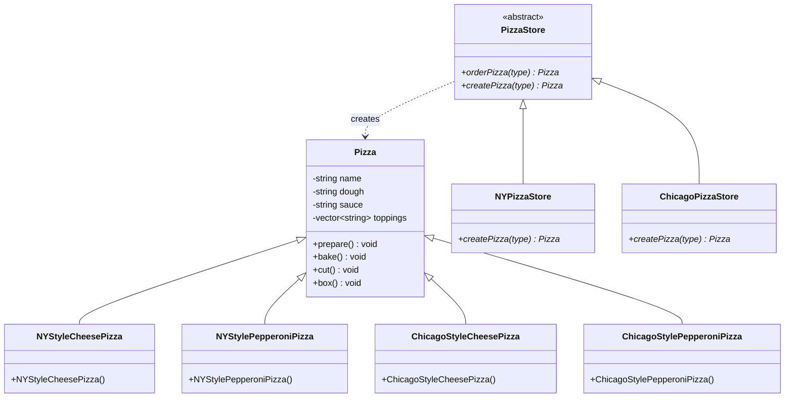

## 工厂模式

```mermaid
classDiagram
    direction TB

    class Pizza {
        -string name
        -string dough
        -string sauce
        -vector~string~ toppings
        +prepare() void
        +bake() void
        +cut() void
        +box() void
    }

    class NYStyleCheesePizza {
        +NYStyleCheesePizza()
    }
    class NYStylePepperoniPizza {
        +NYStylePepperoniPizza()
    }
    class ChicagoStyleCheesePizza {
        +ChicagoStyleCheesePizza()
    }
    class ChicagoStylePepperoniPizza {
        +ChicagoStylePepperoniPizza()
    }

    class PizzaStore {
        <<abstract>>
        +orderPizza(type) Pizza*
        +createPizza(type) Pizza*
    }

    class NYPizzaStore {
        +createPizza(type) Pizza*
    }
    class ChicagoPizzaStore {
        +createPizza(type) Pizza*
    }

    Pizza <|-- NYStyleCheesePizza
    Pizza <|-- NYStylePepperoniPizza
    Pizza <|-- ChicagoStyleCheesePizza
    Pizza <|-- ChicagoStylePepperoniPizza
    PizzaStore <|-- NYPizzaStore
    PizzaStore <|-- ChicagoPizzaStore
    PizzaStore ..> Pizza : creates
```

> `PizzaStore::orderPizza()` 是模板方法，调用子类实现的 `createPizza()` 工厂方法。

