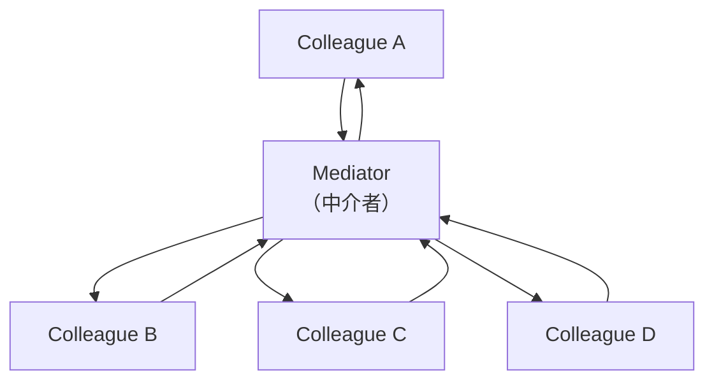

# Mediator

## 动机(Motivation)
+ 多个对象相互关联的情况，对象之间常常会维持一种复杂的引用关系，如果遇到一些需求的更改，这种直接的引用关系将面临不断的变化。
+ 在这种情况下，可以使用一种”中介对象“来管理对象间的关联关系，避免相互交互的对象之间的紧耦合引用关系，从而更好地抵御变化。

## 模式定义
用一个中介对象来封装(封装变化)一系列的对象交互。中介者使各对象不需要显式的相互引用(编译时依赖->运行时依赖)，
从而使其耦合松散(管理变化)，并且可以独立地改变它们之间的交互。
——《设计模式》GoF

## 结构

> 没有中介者时，同事对象之间是网状直接引用（N×N 耦合）；引入中介者后变为星形结构，同事只与中介者通信，由中介者协调交互。

### 与 Façade 的区别

| 模式 | 方向 | 关注层次 |
|------|------|----------|
| **Façade** | 单向（客户→子系统） | 系统间 |
| **Mediator** | 双向（同事↔同事） | 系统内 |

## 要点总结
+ 将多个对象间复杂的关联关系解耦
+ Facade模式是解耦系统间(单向)的对象关联关系；Mediator模式是解耦系统内各个对象之间(双向)的关联关系。
