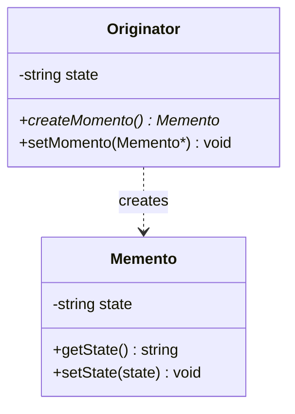

# Memento(备忘录)

## 动机(Motivation)
+ 某些对象的状态转换过程中，可能由于某中需要，要求程序能够回溯到对象之前处于某个点的状态。
如果使用一些公开接口来让其他对象得到对象的状态，便会暴露对象的细节实现。
+ 如何实现对象状态的良好保存与恢复？但同时又不会因此而破坏对象本身的封装性、

## 模式定义
在不破坏封装性的前提下，捕获一个对象的内部状态，并在该对象之外保存这个状态。这样以后就可以将该对象恢复到原先保存的状态。
——《设计模式》GoF

## 结构

> `Originator` 通过 `createMomento()` 保存当前状态到 `Memento` 对象，通过 `setMomento()` 恢复。外部代码只持有 `Memento`，无法直接访问 `Originator` 内部细节。

## 要点总结
+ 备忘录存储原发器(Originator)对象的内部状态，在需要时恢复原发器状态。
+ 有些过时。
