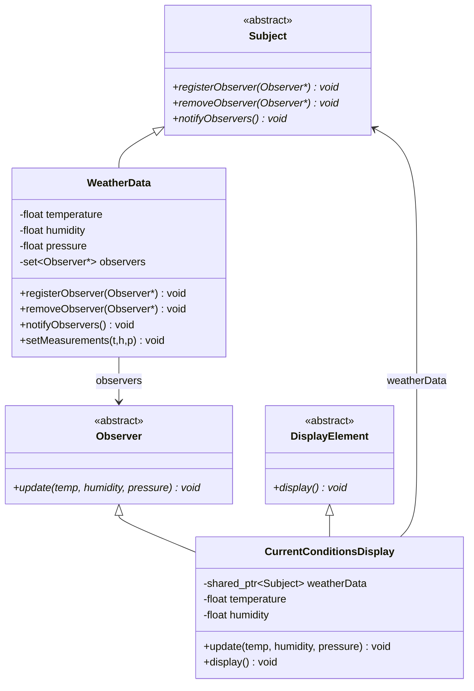

## 观察者模式

```mermaid
classDiagram
    direction TB

    class Subject {
        <<abstract>>
        +registerObserver(Observer*) void*
        +removeObserver(Observer*) void*
        +notifyObservers() void*
    }

    class Observer {
        <<abstract>>
        +update(temp, humidity, pressure) void*
    }

    class DisplayElement {
        <<abstract>>
        +display() void*
    }

    class WeatherData {
        -float temperature
        -float humidity
        -float pressure
        -set~Observer*~ observers
        +registerObserver(Observer*) void
        +removeObserver(Observer*) void
        +notifyObservers() void
        +setMeasurements(t,h,p) void
    }

    class CurrentConditionsDisplay {
        -shared_ptr~Subject~ weatherData
        -float temperature
        -float humidity
        +update(temp, humidity, pressure) void
        +display() void
    }

    Subject <|-- WeatherData
    Observer <|-- CurrentConditionsDisplay
    DisplayElement <|-- CurrentConditionsDisplay
    WeatherData --> Observer : observers
    CurrentConditionsDisplay --> Subject : weatherData
```

> `WeatherData`（Subject）持有 `Observer` 集合，状态变化时遍历通知。`CurrentConditionsDisplay` 同时实现 `Observer` 和 `DisplayElement` 接口。

