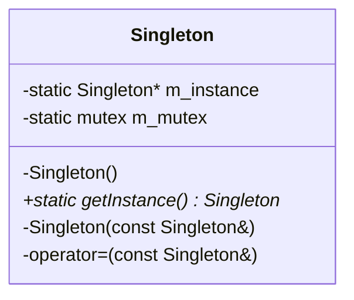

# Singleton

## 动机(Motivation)
+ 在软件系统中，经常有这样一些特殊的类，必须保证它们在系统中只存在一个实例，才能确保它们的逻辑正确性、以及良好的效率。
+ 如何绕过常规的构造器，提供一种机制来保证一个类只有一个实例？
+ 这应该是类设计者的责任，而不是使用者的责任。

## 模式定义
保证一个类仅有一个实例，并提供一个该实例的全局访问点。
——《设计模式》GoF

## 结构



### 线程安全演化（Singleton.cpp）

| 版本 | 方式 | 问题 |
|------|------|------|
| v1 | 简单判空 → `new` | 非线程安全，竞态条件 |
| v2 | 加全局锁后判空 | 线程安全，但每次调用都加锁，性能差 |
| v3 | 双检查锁（DCL） | 内存重排导致不安全 |
| v4 | `atomic` + `memory_order` | ✅ C++11 正确实现 |

```cpp
// v4: C++11 线程安全版本
atomic<Singleton*> Singleton::m_instance;
mutex Singleton::m_mutex;

Singleton* Singleton::getInstance() {
    Singleton* tmp = m_instance.load(memory_order_acquire);
    if (tmp == nullptr) {
        lock_guard<mutex> lock(m_mutex);
        tmp = m_instance.load(memory_order_relaxed);
        if (tmp == nullptr) {
            tmp = new Singleton();
            m_instance.store(tmp, memory_order_release);
        }
    }
    return tmp;
}
```

## 要点总结
+ Singleton模式中的实例构造器可以设置为protected以允许子类派生。
+ Singleton模式一般不要支持拷贝构造函数和Clone接口，因为这有可能导致多个对象实例，与Singleton模式的初中违背。
+ 如何实现多线程环境下安全的Singleton？注意对双检查锁的正确实现。
