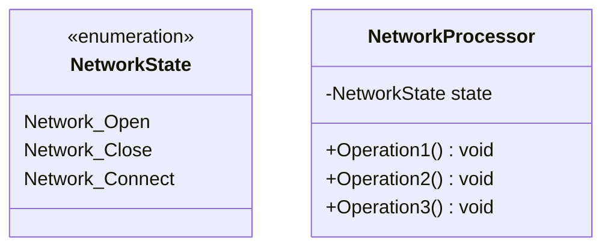
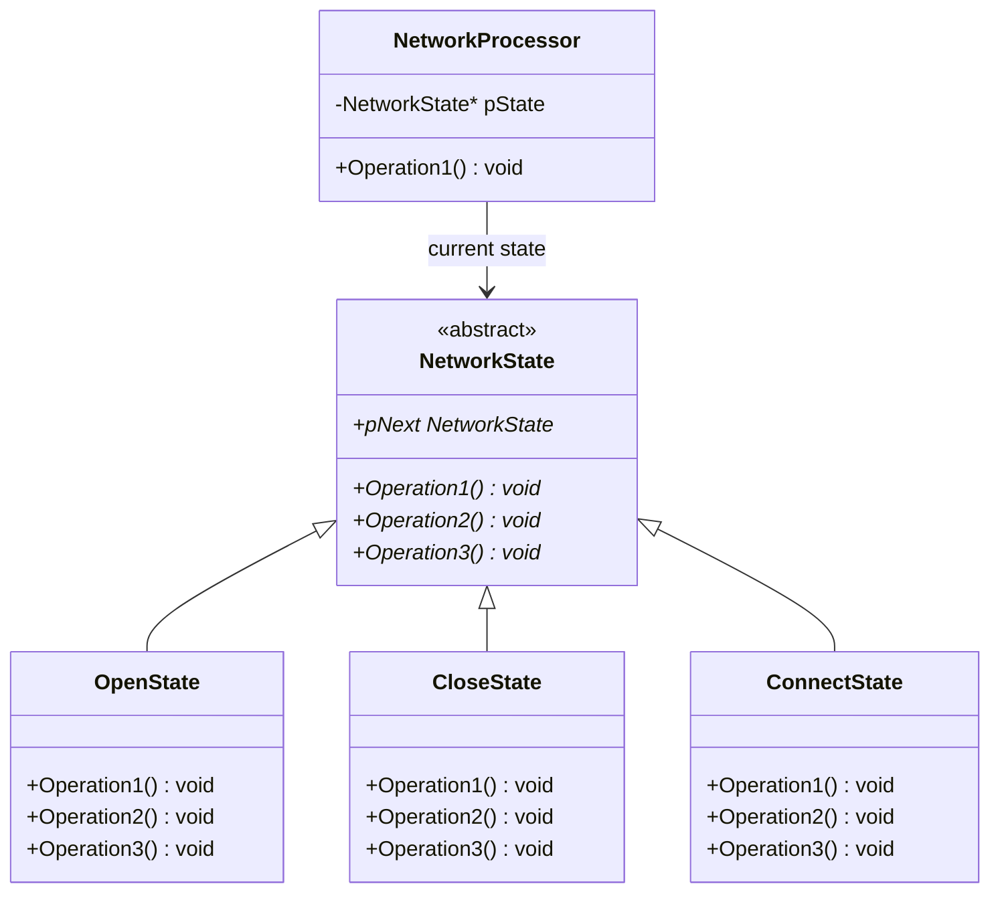

# State

## 动机(Motivation)
+ 对象状态如果改变，其行为也会随之而发生变化，比如文档处于只读状态，其支持的行为和读写状态支持的行为就可能完全不同。
+ 如何在运行时根据对象的状态来透明地改变对象的行为？

## 模式定义
允许一个对象在其内部状态改变时改变它的行为。从而使对象看起来似乎修改了其行为。
——《设计模式》GoF

## 结构演化

### 阶段一：枚举 + if/else（state1.cpp）—— 紧耦合

> 问题：每个操作内部用大量 `if/else` 判断当前状态，新增状态需修改所有操作函数。

### 阶段二：State 模式（state2.cpp）—— 状态对象化

> 完美：每个状态封装自己的行为 + 状态转移。`NetworkProcessor` 委托给当前 `pState`，操作完成后通过 `pNext` 切换状态。

### State vs Strategy

| 维度 | State | Strategy |
|------|-------|----------|
| 切换时机 | 内部自动切换（状态驱动） | 外部主动设置 |
| 对象数量 | 每个状态一个对象 | 每个策略可共享单例 |
| 关注点 | 对象行为随状态变化 | 算法可互换 |

## 要点总结
+ State模式将所有与一个特定状态相关的行为都放入一个State的子对象中，在对象状态切换时，切换相应的对象；
但同时维持State的接口，这样实现了具体操作与状态转换之间的解耦。
+ 转换是原子性的
+ 与Strategy模式类似
