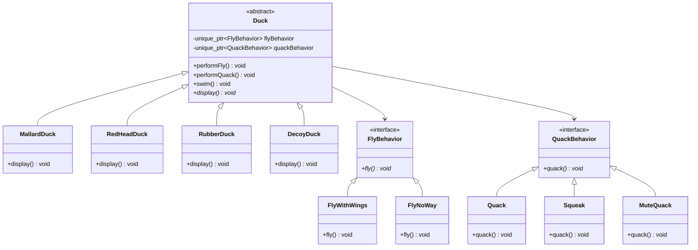

## 策略模式

> 飞行行为和叫声行为被抽象为独立的策略接口。每种鸭子组合不同的行为策略，且可在运行时替换。

| 鸭子 | 飞行 | 叫声 |
|------|------|------|
| MallardDuck | FlyWithWings | Quack |
| RedHeadDuck | FlyWithWings | Quack |
| RubberDuck | FlyNoWay | Squeak |
| DecoyDuck | FlyNoWay | MuteQuack |

