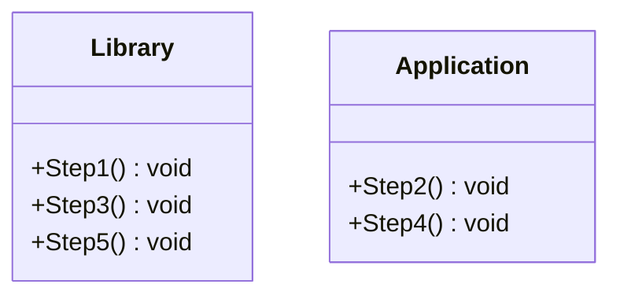
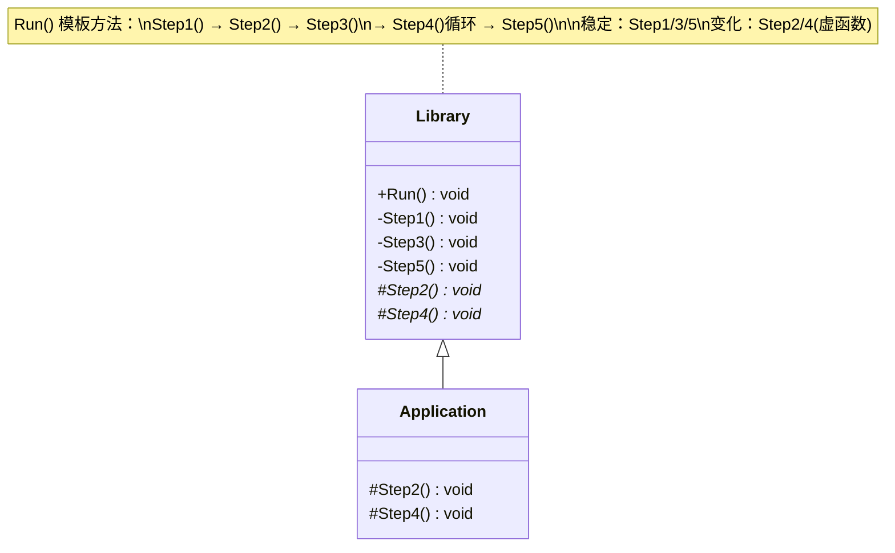

# Template Method

## 动机（Motivation）
+ 在软件构建过程中，对于某一项任务，它常常有稳定的整体操作结构，但各个子步骤却有很多改变的需求，或者由于固有的原因（比如框架与应用之间的关系）而无法和任务的整体结构同时实现。
+ 如何在确定稳定操作结构的前提下，来灵活应对各个子步骤的变化或者晚期实现需求？

## 模式定义
定义一个操作中的算法的骨架 **(稳定)** ，而将一些步骤延迟 **(变化)** 到子类中。
Template Method使得子类可以不改变(复用)一个算法的结构即可重定义(override 重写)该算法的
某些特定步骤。
——《 设计模式》 GoF

## 结构演化

### 阶段一：无模板方法（template1）—— 客户端控制流程

> 问题：`main()` 中应用开发者必须手动按序调用 `lib.Step1() → app.Step2() → lib.Step3() → app.Step4() → lib.Step5()`，易出错。

### 阶段二：Template Method 模式（template2）—— 框架控制流程

> 完美：**"不要调用我，让我来调用你"** —— `Library::Run()` 控制整体算法骨架，子类只需重写变化的步骤。
## 要点总结
+ Template Method模式是一种非常基础性的设计模式，在面向对象系统中有着大量的应用。它用最简洁的机制（虚函数的多态性）
为很多应用程序框架提供了灵活的扩展点，是代码复用方面的基本实现结构。
+ 除了可以灵活应对子步骤的变化外， **“不要调用我，让我来调用你”** 的反向控制结构是Template Method的典型应用。
+ 在具体实现方面，被Template Method调用的虚方法可以具有实现，也可以没有任何实现（抽象方法、纯虚方法），但一般推荐将它们设置为protected方法。
