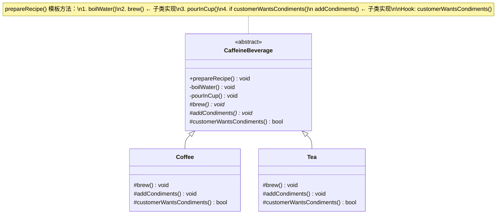

## 模板方法模式

```mermaid
classDiagram
    direction TB

    class CaffeineBeverage {
        <<abstract>>
        +prepareRecipe() void
        -boilWater() void
        -pourInCup() void
        #brew() void*
        #addCondiments() void*
        #customerWantsCondiments() bool
    }

    class Coffee {
        #brew() void
        #addCondiments() void
        #customerWantsCondiments() bool
    }

    class Tea {
        #brew() void
        #addCondiments() void
        #customerWantsCondiments() bool
    }

    CaffeineBeverage <|-- Coffee
    CaffeineBeverage <|-- Tea

    note for CaffeineBeverage "prepareRecipe() 模板方法：\n1. boilWater()\n2. brew() ← 子类实现\n3. pourInCup()\n4. if customerWantsCondiments()\n     addCondiments() ← 子类实现\n\nHook: customerWantsCondiments()"
```

> `prepareRecipe()` 是模板方法，定义了冲泡流程骨架。`brew()` 和 `addCondiments()` 由子类实现。`customerWantsCondiments()` 是钩子方法（Hook），子类可选择性覆盖来控制流程。

