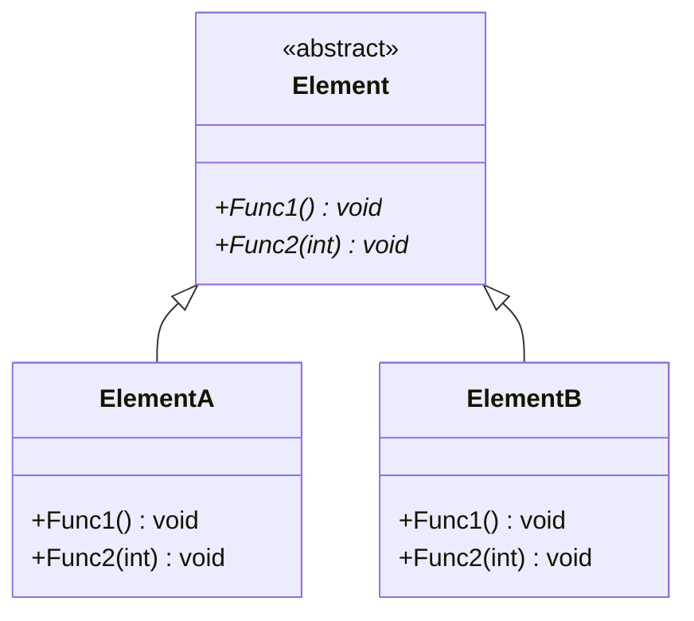
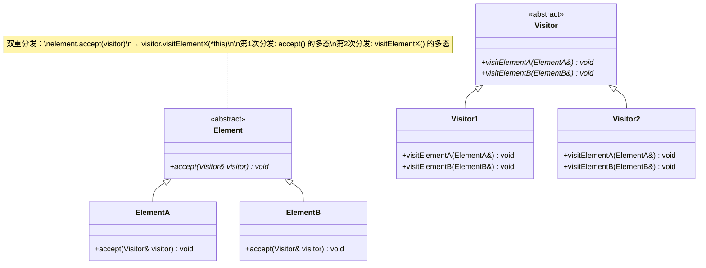

# Visitor

## 动机(Motivation)
+ 由于需求的变化，某些类层次结构中常常需要增加新的行为(方法)，如果直接在基类中做这样的更改，
将会给子类带来很繁重的变更负担，甚至破坏原有设计。
+ 如何在不更改类层次结构的前提下，在运行时根据需要透明地为类层次结构上的各个类动态添加新的操作，从而避免上面的问题？

## 模式定义
表示一个作用与某对象结构中的各元素的操作。使得可以在不改变(稳定)各元素的类的前提下定义(扩展)
作用于这些元素的新操作(变化)。
——《设计模式》GoF
## 结构演化

### 阶段一：无 Visitor（Visitor1.cpp）—— 方法写死在 Element 中

> 问题：新增操作（如 `Func3`）需要修改 `Element` 基类及所有子类。

### 阶段二：Visitor 模式（Visitor2.cpp）—— 双重分发

> 完美：新增操作只需增加 `Visitor` 子类，无需改动 `Element` 层次结构。但**缺点**是增加新 `Element` 子类需要修改所有 `Visitor`。
## 要点总结
+ Visitor模式通过所谓的双重分发来实现在不更改(编译时)Element类层次结构的前提下，在运行时
透明地为类层次结构上的各个类动态添加新的操作(支持变化)。
+ 所谓双重分发Visitor模式中间包括了两个多态分发：第一个为accept方法的多态辨析；第二个为visitElement方法的多态辨析。
+ Visitor模式的最大缺点在于扩展类层次结构(添加新的Element子类)，会导致Visitor类的改变，
因此Visitor模式适用于“Element类层次结构稳定，而其中的操作却经常面临频繁改动”。
